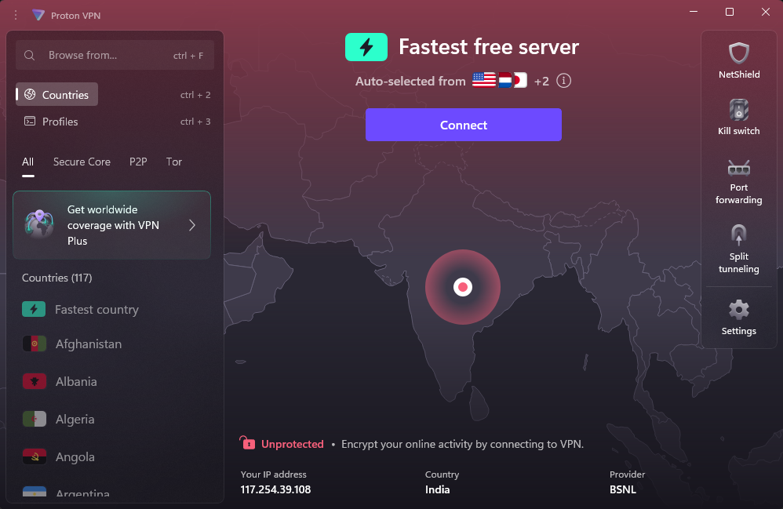
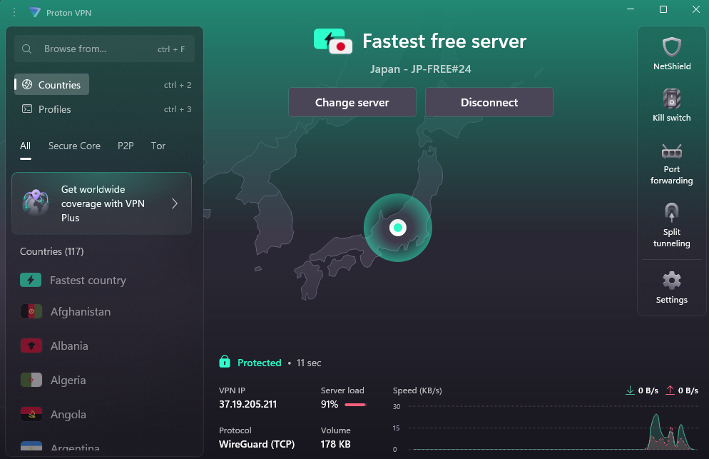
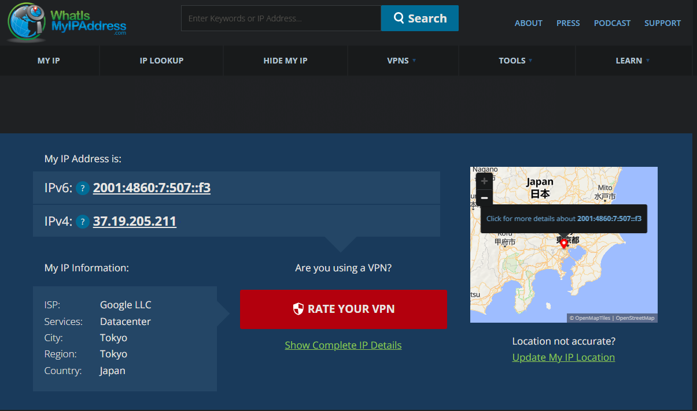

# 🛡️ VPN Privacy & Security Report

## Objective

Understand the role of VPNs in protecting privacy and securing communication by setting up a free VPN client, verifying its operation, and analyzing its impact on network speed and IP address.

## Before vs After: Results

### Connection Status

| State         | Screenshot      | Description                                     |
|---------------|----------------|-------------------------------------------------|
| **Before VPN**  |  | Not connected, real IP/location visible.        |
| **After VPN**   |   | Connected to Japan server, new VPN IP assigned. |

---

###  IP Address Change

- **Before VPN:**  
  - IP: `117.254.x.x`  
  - Location: India

- **After VPN:**  
  - IP: `37.19.205.211`  
  - Location: Japan

- **Result:**
  
  IP address and visible location changed, confirming VPN is masking real identity and encrypting traffic.
  
  

---

# Conclusion

Setting up and using ProtonVPN successfully demonstrated how VPNs encrypt internet traffic, mask real IP addresses, and protect privacy online.
VPNs are a crucial tool for privacy-conscious users, but they are not a complete solution for all online threats.

---
